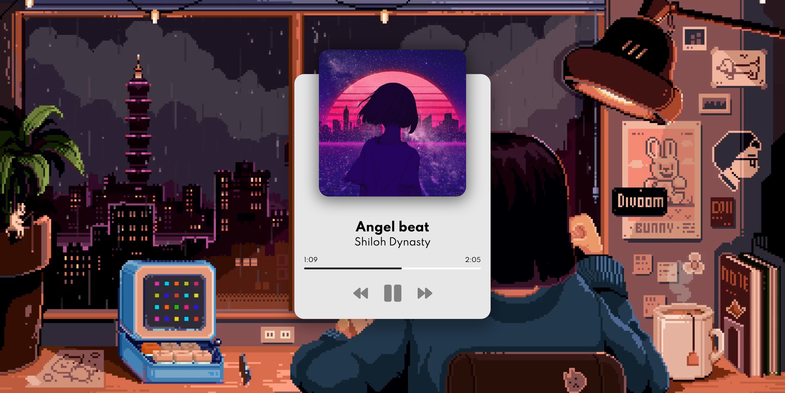

<h2>☑️ What I have created?</h2>

A music player application using HTML5, CSS3 and Javascript and built UI for next button, previous button, pause, play and also displays the display of the 
<h3><a href="https://nigorafayzullaeva.github.io/music-player-js/">Live Demo</a></h3>
<h2>☑️ Final look of player🎵</h2>

